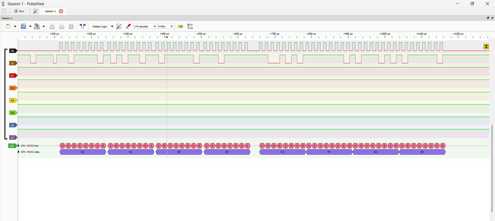

# STM32F401RE Bare-Metal Hardware Abstraction Layer (HAL)

This repository contains a custom, from-scratch bare-metal hardware abstraction layer for the STM32F401RE microcontroller. The driver stack was developed directly from the MCU reference manual without relying on ST's HAL or LL libraries, ensuring minimal overhead and deep hardware-level control.

## Core Features & Architecture

### General Purpose I/O (GPIO)
* **Pin Control:** Configurable I/O modes (Input, Output, Alternate Function, Analog), output speeds, and push-pull/open-drain topologies.
* **Hardware Interrupts:** EXTI (External Interrupt) configuration supporting rising/falling edge triggers with automated SYSCFG routing.
* **Memory Access:** Explicit casting and bitwise operations to prevent integer promotion and undefined behavior during register shifts.

### Serial Peripheral Interface (SPI)
* **Bus Topologies:** Supports Full-Duplex, Half-Duplex, and Simplex (Receive Only) master configurations.
* **Frame Formats:** 8-bit and 16-bit Data Frame Formats (DFF) with payload underflow protection.
* **Transfer Modes:** Blocking (polling-based) and Non-Blocking (interrupt-driven) transfer APIs with `TXE`, `RXNE`, and `OVR` ISR handling.
* **Slave Management:** Configurable Software Slave Management (SSM) and Internal Slave Select (SSI).

### Inter-Integrated Circuit (I2C)
* **Clocking:** Standard Mode (SM) and Fast Mode (FM) clock generation calculated dynamically from active RCC bus frequencies.
* **State Machine:** Repeated Start (Sr) generation and volatile-casted STOP condition handling for compiler optimization (`-O3`) safety.
* **Synchronization:** ACK/NACK management utilizing Byte Transfer Finished (BTF) hardware synchronization for final-byte reception.
* **Background Processing:** Interrupt-driven transfers handling data requests and asynchronous bus errors (BERR, ARLO, AF).

### Universal Synchronous Asynchronous Receiver Transmitter (USART)
* **Baud Generation:** Fractional baud rate calculation derived from active APB1/APB2 clock speeds and OVER8/OVER16 sampling configurations.
* **Protocol Configuration:** 8/9-bit word lengths, parity controls (Even/Odd/None), and variable stop bits.
* **Interrupt Handling:** Non-blocking APIs for RX/TX context switching, utilizing frame-count logic rather than byte-count logic for memory safety.
* **Flow Control:** Hardware flow control (CTS/RTS) support.

### Reset & Clock Control (RCC) & Cortex-M4 Core
* **Clock Trees:** Real-time APB1 and APB2 peripheral clock frequency calculations supporting HSI/HSE sources and variable prescalers.
* **NVIC Integration:** Centralized Nested Vectored Interrupt Controller configuration using "Write-1-to-Set" and "Write-1-to-Clear" operations for interrupt masking.
* **Hardware Reset:** `DeInit` peripheral reset macros utilizing the AHB/APB reset registers for silicon state recovery.

## Hardware-in-the-Loop (HIL) Testing
The driver stack was validated using a physical Hardware-in-the-Loop test fixture. An Arduino board was deployed as a deterministic response server to validate timing synchronization, verify interrupt preemption, and ensure no race conditions or data overruns occur during high-speed non-blocking transfers.

## Logic Analyzer Verification
To ensure data integrity and timing accuracy at the silicon level, all communication buses were verified using a logic analyzer and PulseView.

**SPI Full-Duplex Transfer:**

**I2C Interrupt-Driven Communication:**

**USART Polling & Interrupt Context Switching:**

